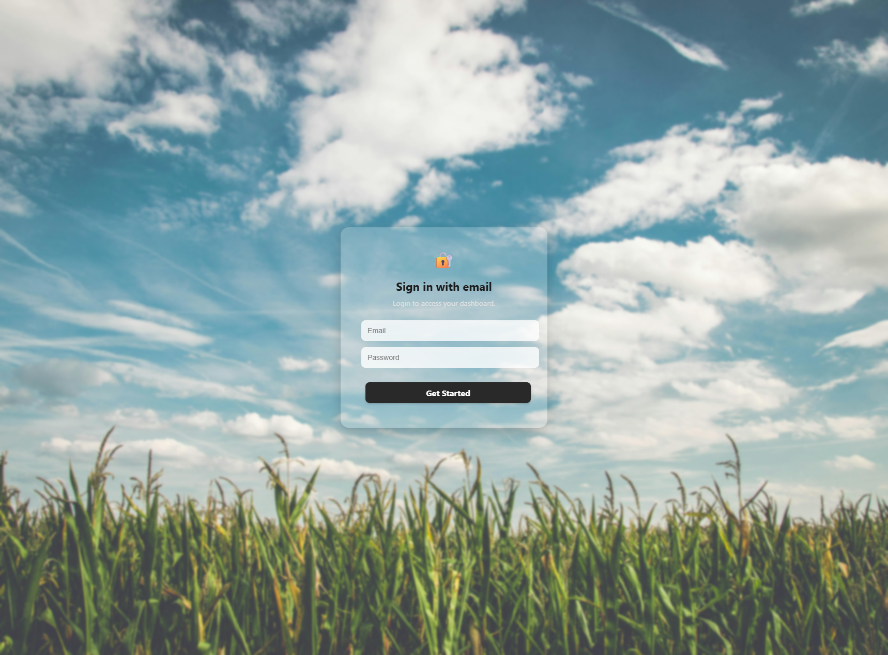
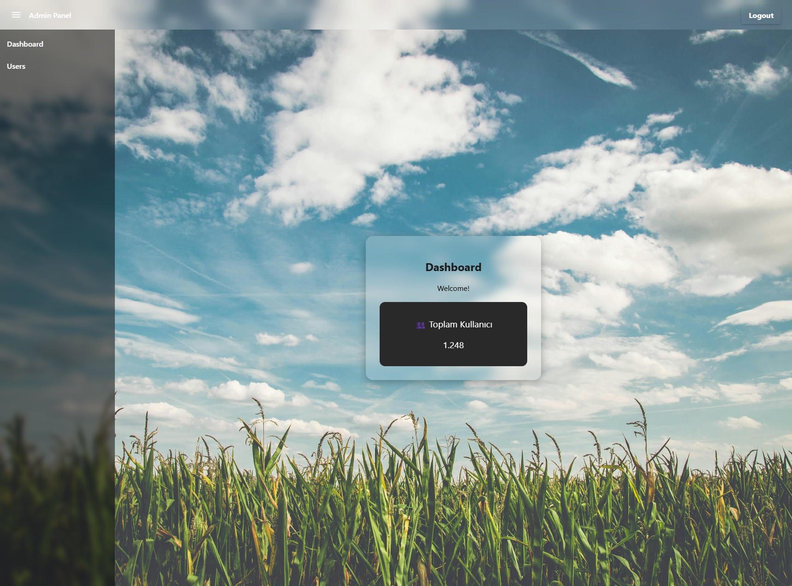
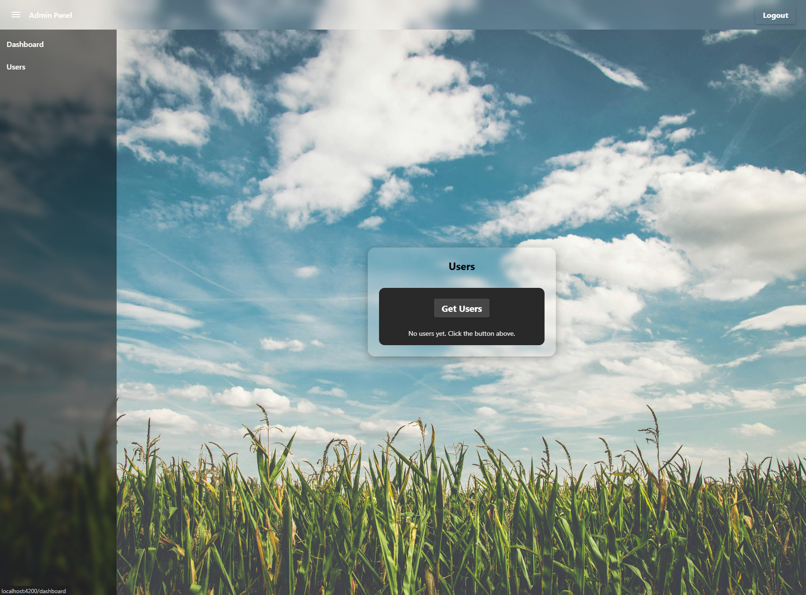
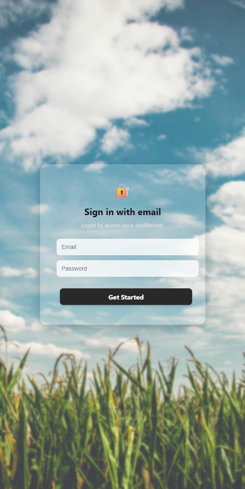
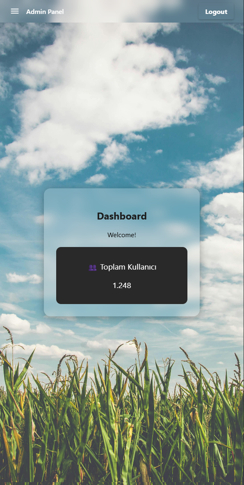
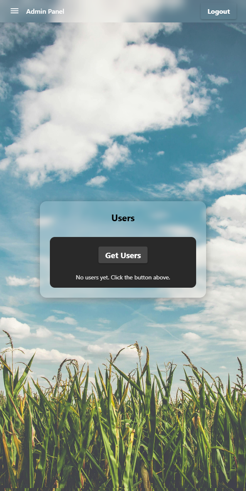
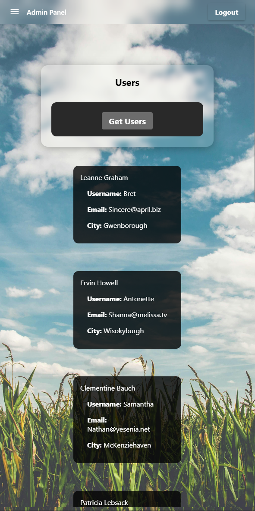

# 🌤️ Admin Panel with Angular Standalone + Material UI

This project is a responsive Admin Panel built with Angular Standalone architecture and Angular Material. It includes:
- A modern login screen with a blurred background.
- A responsive layout with a collapsible sidebar.
- Dynamic Dashboard and Users pages.
- Mobile-first design principles.

---

## ✨ Features

- ✅ Modern glassmorphism UI
- ✅ Responsive layout with automatic sidebar toggle on mobile
- ✅ Standalone Angular components
- ✅ Lazy loaded routes
- ✅ Material components used modularly
- ✅ Live user data fetched via HTTP

---

## 🖥️ Web View

### 🔐 Login Page


### 📊 Dashboard Page


### 👥 Users Page (Before Fetching)


### 👥 Users Page (After Fetching)


---

## 📱 Mobile View

### 🔐 Login Page (Mobile)


### 📊 Dashboard Page (Mobile)


### 👥 Users Page (Before Fetching - Mobile)


### 👥 Users Page (After Fetching - Mobile)


---

## 🔧 Technologies Used

- Angular 17 Standalone Architecture
- Angular Material UI
- TypeScript
- RxJS
- Responsive Design via CSS Flexbox
- BreakpointObserver for adaptive layout

---

## 📝 Notes

- Users are fetched from: `https://jsonplaceholder.typicode.com/users`
- `HttpClient` is imported and used in a fully standalone manner.
- Sidebar automatically closes on navigation when on mobile screen sizes.
- "Uses Angular Material components (toolbar, sidenav, buttons, cards etc.), but with fully customized CSS for modern glassmorphism design."

---

## 🚀 Getting Started

```bash
git clone https://github.com/mfurkanayhan/angular-admin-panel.git
cd admin-panel
npm install
ng serve
